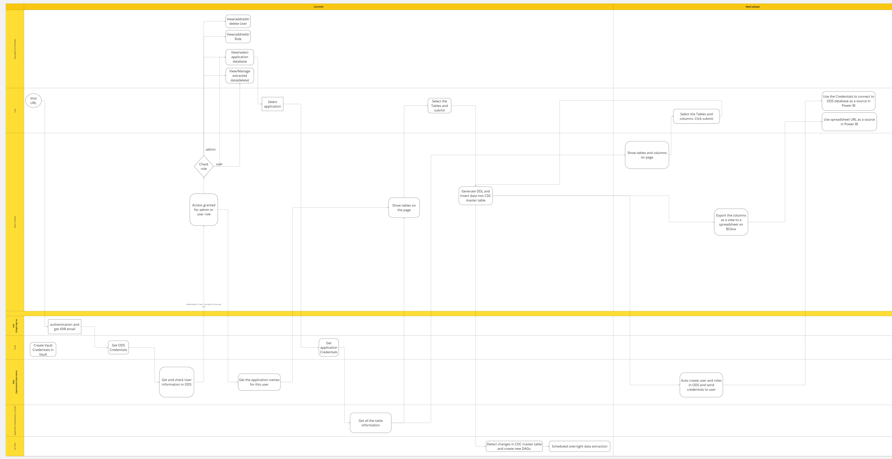

# DAPUI

Welcome to the DAPUI repository! This project is a part of the Data Foundation team to provide a user-friendly interface for managing data extraction low code/no code tool within the public sector.

## Overview

DAPUI is designed to streamline the management of data access requests and extraction. This tool facilitates the process of requesting, approving, and auditing access to various data sets, enhancing transparency and security within the organization.

## Features

- **User Management**: Admins can manage user roles and permissions, ensuring that only authorized personnel have access to sensitive data.
- **Access Requests**: Users can submit requests for data access, which can be reviewed and approved by designated approvers.
- **Audit Trails**: All access requests and approvals are logged, providing a comprehensive audit trail for compliance and monitoring purposes.
- **Integration**: DAPUI integrates with existing systems to streamline data access workflows and reduce administrative overhead.
- **Responsive Design**: The interface is designed to be accessible on various devices, providing a consistent experience across desktops, tablets, and smartphones.

## Getting Started

To get started with DAPUI, follow the instructions below to set up your development environment and run the application locally.
Create a file name .env for environment variables.
1. **Create .env file and edit it**:
   ```sh
    KEYCLOAK_SECRET=CHANG TO YOUR SECRET
    CONFIG_BROKER_JWT=CHANG TO YOUR SECRET
    CONFIG_VAULT_ENV=dev

Edit the secret key. KEYCLOAK_SECRET is for SSO. CONFIG_BROKER_JWT is for vault api key. CONFIG_VAULT_ENV can be dev or prd.

### Prerequisites

- Node.js
- npm (Node Package Manager)
- Git

### Installation

1. **Run the code**:
   ```sh
   git clone https://github.com/bcgov/DAPUI.git
   npm install
   node app.js
   
2. **Deploy to openshift**:
   ```sh
   oc new-app --docker-image=ghcr.io/zhongjixiehou/nr-dap-ui:latest --name=nr-dap-ui
### update
   ```sh
   oc rollout restart deployment/nr-dap-ui
### Contact

If you have any questions or need further assistance, please feel free to reach out via email: NRM.DataFoundations at gov.bc.ca.

### Flow Chart

